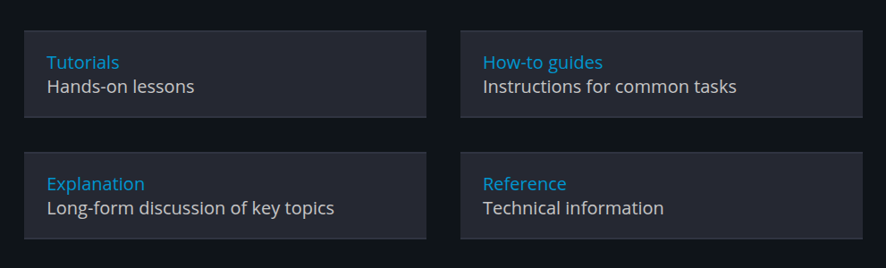
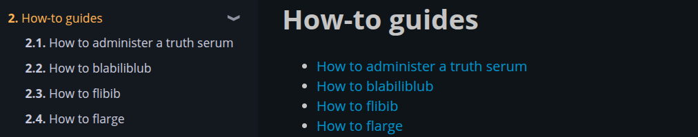

# mdbook-diataxis

A preprocessor for [mdBook][mdbook] which helps apply the [diátaxis][diataxis] documentation framework.

## Installation

Type and run

```bash
cargo install mdbook-diataxis
```

This will build `mdbook-diataxis` from source.

## Integrating `mdbook-diataxis`

Add the following line to your `book.toml`:

```toml
[preprocessor.diataxis]
```

And now `mdbook-diataxis` is ready for use!

<!-- TODO(kcza): add `cargo-binstall` installation option. -->

## Usage

This preprocessor defines the following directives.

### `{{#diataxis compass}}`

Expands to an `html` representation of of the diátaxis compass.
Example:



The text of each part of the compass can be [configured via `book.toml`](#configuration).

### `{{#diataxis table-of-contents}}`

Expands to a table of contents listing the top-level children of the current chapter.



## Configuration

The following is a configuration of `mdbook-diataxis` which modifies every available field.
This snippet is for demonstration purposes; all fields are optional.

```toml
[preprocessor.diataxis.compass.tutorials]
title = "new Tutorials title"
description = "new Tutorials description"
link = "path/to/tutorials.html"

[preprocessor.diataxis.compass.how-to-guides]
title = "new How-to guides title"
description = "new How-to guides description"
link = "path/to/how-to-guides.html"

[preprocessor.diataxis.compass.explanation]
title = "new Explanation title"
description = "new Explanation description"
link = "path/to/explanation.html"

[preprocessor.diataxis.compass.reference]
title = "new Reference title"
description = "new Reference description"
link = "path/to/reference.html"
```

## License

This project is [licensed under GPLv3](LICENSE).

[diataxis]: https://diataxis.fr
[mdbook]: https://github.com/rust-lang/mdBook
